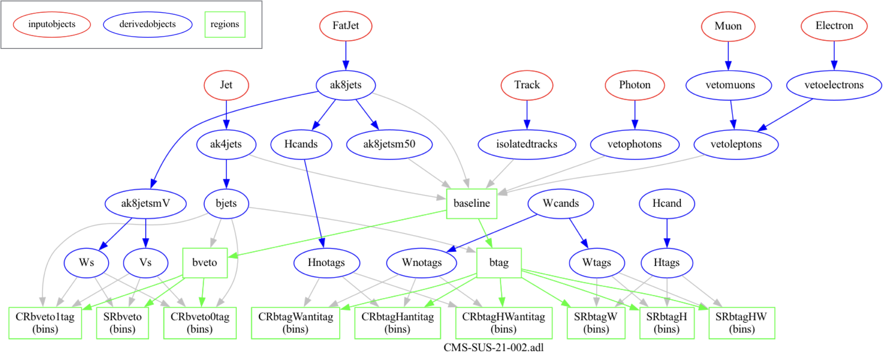

We will use ADL and CutLang for the reinterpretation exercise.  Let's first learn what these are.

## What is ADL?

(More information on [cern.ch/adl](cern.ch/adl))

LHC data analyses are usually performed using complex analysis frameworks written in general purpose languages like C++ and, more recently, Python. This method is very flexible, and usually is easy for simple analyses with simple selections.  But a lot of real-life analyses have very complex object definitions and event selections.  Especially analyses that search for new physics, and thus are most relevant for reinterpretation tend to be quite intricate.

For example, take a look at the graph below, which describes a CMS search for supersymmetry ([arXiv:2205.09597](https://arxiv.org/abs/2205.09597)):

This analysis works with several different types of objects and multiple event selection regions, some of which are dependent on each other.  Analyses we consider for reinterpretation are usually at least as complex as this one!

When we code such an analysis with a general purpose language, it becomes increasingly harder to visualize and keep track of the physics algorithm details.  As the analysis physics content becomes more intricate, analysis code will become more complex, and harder to follow.  It will be harder to trace, for example, which identification criteria define a certain object, which version of an object is used in which event selection region, etc. 

The main reason behind this is that, when we write code using general purpose languages, we intertwine the physics algorithm with other technical details, e.g. accessing files, accessing variables, importing modules, etc.  Despite the flexibility, all such technicalities obscure the code.

We present a modern method which allows to decouple physics algorithm from the technical code and write analyses with a simple, self-describing syntax.  **Analysis Description Language (ADL)** is a HEP-specific analysis language developed with this purpose. Its main goal is to describe analyses in a more intuitive and physics-focused way. ADL is a transparant map from the input variables to the analysis selection.

More formally, ADL is a declarative domain specific language (DSL) that describes the physics content of a HEP analysis in a standard and unambiguous way. 
* External DSL: Custom-designed syntax to express analysis-specific concepts. Reflects conceptual reasoning of particle physicists.  
* Declarative: Tells what to do, but not how to do it.
* Human readable: Clear, self-describing syntax rules.
* Designed for everyone: experimentalists, phenomenologists, students, interested public…

### Framework independence

ADL is designed to be framework-independent. Any framework recognizing ADL can perform tasks with it.
Physics information becomes independent from software and framework details.  This allows:
* Multi-purpose use of analysis description: Can be automatically translated or incorporated into the GPL / framework most suitable for a given purpose, e.g. exp, analysis, (re)interpretation, analysis queries, …
* Efficient communication between groups: experimentalists, phenomenologists, referees, students, public, …
* Accessible **preservation** of analysis physics logic.

### Context and syntax

ADL mainly focuses on describing *event processing*.  This includes object selections, event variable definitions and event selections.  It can also described histogramming, and partially systematic uncertainties.

ADL consists of blocks separating object, variable and event selection definitions for a clear separation of analysis components. Blocks have a keyword-expression structure. Keywords specify analysis concepts and operations.  Syntax includes mathematical and logical operations, comparison and optimization operators, reducers, 4-vector algebra and HEP-specific functions (dphi, dR, etc.).   

ADL is designed with the goal to be self-describing, so especially for simple cases, one does not need to read syntax rules to understand an ADL description.  However if you are interested, the set of syntax rules can be found [here]( https://twiki.cern.ch/twiki/bin/view/LHCPhysics/ADL).

### A physics analysis database

ADL is a *standard*, which allows all analyses to be described in the same way.  Having access to many analyses written in the same way can help us understand them easier, learn their physics logic easily, and use them in our own studies.

All these make ADL an excellent medium for reinterpretation studies. 

## What is CutLang?

Once an analysis is written it needs to be run on events.  This is achieved by **CutLang** , the runtime interpreter that reads and understands the ADL syntax and runs it on events.  A runtime interpreter does not require to be compiled.  The user only modifies the ADL description, and runs CutLang.  CutLang is also a framework which automatically handles many tedious tasks as reading input events, writing output histograms, etc.  CutLang can be run on various environments such as linux, mac, conda, docker, jupyter, etc.  

In case you are interested to learn more on CutLang, please see the [CutLang github](https://github.com/unelg/CutLang) and references in the [cern.ch/adl](cern.ch/adl)) portal.



