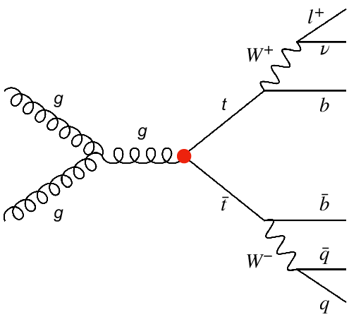
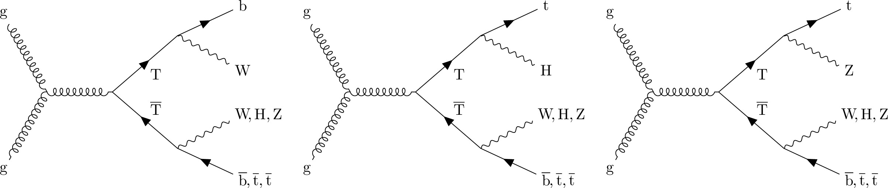

> ## Prerequsite: CutLang-root-vnc Docker container and basic familiarity with running CutLang
> The exercises here will be run in the CutLang docker container.
> Make sure you have followed [Episode 3: Installing CutLang](https://cms-opendata-workshop.github.io/workshop2023-lesson-reinterpretation/03-installing-cutlang/index.html), have a working `CutLang-vnc-root` container setup, and are able to run CutLang.
{: .prereq}

## A familiar analysis for a new signal

In this exercise, we are going to take the top-antitop quark pair production analysis example you studied in the [simplified analysis example session](https://cms-opendata-workshop.github.io/workshop2023-lesson-ttbarljetsanalysis/) and use it to demonstrate a simple optimized reinterpretation case.  We will modify the analysis selection, so that the analysis becomes sensitive to a new physics scenario, namely, [vector-like quarks](https://lifeandphysics.com/2020/06/15/vector-like-quarks/).

Let's remember the top-antitop quark process, which was the signal in the ttbar analysis:

{:width="15%"}.

Now let's see our new signal, the vector-like top quark T, in its pair production mode, and with its decays:

{:width="75%"}.

The vector-like T quark has similar properties with the SM top quark.  For example, it can be pair produced, and decay to bW.  But T can be much heavier.  This opens different decays channels through Z and Higgs boson, as seen in the figure above.  The heavier T gets, the more Lorentz boost its decay products receive.  Our signal is a mixture of all the above decay channels.  We will work with a signal benchmark with T mass = 800 GeV.  We will also check results for two other benchmarks with T mass = 700 and 1200 GeV.

## Exact reinterpretation

What happens if we reinterpreted the top-antitop analysis in terms of the vector-like T model?  Is the analysis sensitive to the vector-like T signal?
In order to find out, we must run the analysis on at least the signal events.  It turns out, our signal events are available in open data, and even in POET format:

| T mass (GeV) | cross section (pb) | OD record | POET ntuple |
|--------|---------------|-----------|-------------|
| 700    |     0.455     | [20232](https://opendata.cern.ch/record/20232) | `RunIIFall15MiniAODv2_TprimeTprime_M-700_TuneCUETP8M1_13TeV-madgraph-pythia8_flat.root` |
| 800    |     0.196     | [20233](https://opendata.cern.ch/record/20233) | `RunIIFall15MiniAODv2_TprimeTprime_M-800_TuneCUETP8M1_13TeV-madgraph-pythia8_flat.root` |
| 1200   |     0.0118    | [20225](https://opendata.cern.ch/record/20225) | `RunIIFall15MiniAODv2_TprimeTprime_M-1200_TuneCUETP8M1_13TeV-madgraph-pythia8_flat.root` |

The POET ntuples have the prefix address: `root://eospublic.cern.ch//eos/opendata/cms/derived-data/POET/23-Jul-22/` (add the root file name to the end).

Next comes the implementation of the analysis.  We already have a version in ADL.  Let's download it to the docker container:

~~~
wget https://raw.githubusercontent.com/ADL4HEP/ADLAnalysisDrafts/main/CMSODWS23-ttbartovlq/ttbartovlq_step1.adl
~~~
{: .language-bash}

Open the ADL file and see
* how the object definitions are written
* how the top candidate is reconstructed
* how the event selections are done for different regions and how the different regions are related
* how the histograms are defined.

> ## Discussion
> What do you think about describing the analysis in this manner?  Is it useful to see all the physics algorithm in one place?
{: .discussion}

Now let's run the ADL file using CutLang over the Tmass = 800 GeV signal for 30000 events:

~~~
CLA root://eospublic.cern.ch//eos/opendata/cms/derived-data/POET/23-Jul-22/RunIIFall15MiniAODv2_TprimeTprime_M-800_TuneCUETP8M1_13TeV-madgraph-pythia8_flat.root POET -i ttbartovlq_step1.adl -e 30000
mv histoOut-ttbartovlq_step1.root histoOut-ttbartovlq_TT800.root
~~~
{: .language-bash}

Look at the text output and the cutflow shown there.  Which cuts reduce the events most?

Now let's compare the top candidate mass from the signal with that of the `ttbar` process, which, in this case becomes our dominant background.
Event yields for various processes are usually provided with the analysis publication or in HepData, but in this case, we will get them ourselves.  We can run the above ADL file on some ttbar events:
~~~
CLA root://eospublic.cern.ch//eos/opendata/cms/derived-data/POET/23-Jul-22/RunIIFall15MiniAODv2_TprimeTprime_M-800_TuneCUETP8M1_13TeV-madgraph-pythia8_flat.root POET -i ttbartovlq_step1.adl -e 400000
mv histoOut-ttbartovlq_step1.root histoOut-ttbartovlq_SMttbar.root
~~~
{: .language-bash}
Or alternatively, to save time you can download the `SMttbar` output file as

~~~
wget https://www.dropbox.com/scl/fi/aptqbtwniuyj7les71al9/histoOut-ttbartovlq_SMttbar.root
~~~
{: .language-bash}

Next, let's go to Jupyter and open a notebook to read the output ROOT files and draw histograms.
Assuming you are still in the default `src/` directory of the docker container, go to the `../CutLang/binder` directory and start Jupyter:
~~~
cd ../CutLang/binder/
CLA_Jupyter lab
~~~
(remember that you need to copy the url address at the bottom to your browser).

> ## Tip for Jupyter
> To make it easy to switch between Jupyter and the container prompt, you can work with two separate containers.  You can do this by executing the container > again in a different terminal shell.
{: .callout}

Select the notebook `ROOTweightedcomparison.ipynb`.  This notebook retrieves the set of histograms you select and plots them after applying weights that normalize them to cross section times luminosity.  This means, the events in the histogram correspond to the event one would expect at the LHC.
Overview the code and execute the cells. You will see histograms appearing.

> ## Discussion
> Take a look at the top candidate mass distributions:
> * Can this variable discriminate the signal from background?
> * How does the signal / background ratio look?  Do you think this selection is sensitive to our signal?
> Now take a look at the `cutflow` histograms.  These are generated automatically by CutLang.
> * Is there any difference in event reduction rate between the signal and background?
{: .discussion}

## Optimized reinterpretation

### Finding and adding discriminating variables

We see that the ttbar analysis is not the best way to look for vector-like T quarks.  Now let's try to improve the selection to increase analysis sensitivity.
To devise an improved selection, we should guess some variables with discriminating power and plot them for signal and background.

> ## Discussion
> What could be some signal discriminating variables?  How could we determine them?
{: .discussion}

Main difference is that the signal events have a larger object multiplicity and decay products with bigger boost.  This consequentally leads to larger transverse activity, both visible and invisible.

> ## Challenge: Histogramming candidiate discriminating variables
> Here are some ideas for discriminating variables.  Please add histograms for these to the ADL file, under the `fourjettwob` region:
> * Top quarks coming from T decays may have a large Lorentz boost, top candidate pT could be a discriminant.  
>   * histogram name: `hpttop`; fixed bins: `20, 50, 1550`
>   * histogram name: `h2pttop`: variable bins: `50 100 150 200 300 400 500 600 700 800 1000 1500 2000`
> * Signal should have higher jet multiplicity.  Add number of jets.
> * histogram name: `hnjets` ; fixed bins: `20, 0, 20`
> * pTs of the first 3 jets can be relatively higher.  Add these three as separate histograms:
>   * histogram names: `hj1pT`, `hj2pT`, `hj3pT` ; fixed bins: `20, 50, 1050`
> * Signal can have larger MET.  IMPORTANT: The variable to use for MET in ADL is simply `MET`.
>   * histogram name: `hmet` ; variable bins: `50 75 100 150 200 300 500 700 1000 1300`
* Signal can have larger visible transverse activity.  A variable typically used is `ST`, which equals to the sum of MET, pT of the first lepton and scalar sum of the pTs of all jets in the event.
>   * Add `ST` to the ADL file.  Add the following lines just before the event selection:
>  ~~~
>  define ST = MET + pT(leptons[0]) + fHT(jets)
>  ~~~
>  You can use the variable `ST` in the event selection.
>  * Add the `ST` histogram with name: `hST`; variable bins: `500 600 700 800 1000 1125 1500 1700 2000 2500 3000 4500`
> * Signal has decays to boosted W, Z and Higgs bosons. Boosted objects can be clustered into large radius jets. Signal can have a larger number of large radius jets.
>   * Define an `AK8jets` object in the ADL fille by adding the following object block to the object definitions section:
>  ~~~
>  object AK8jets
>    take FJet
>    select pT(FJet) > 200
>    select abs(Eta(FJet)) < 2.4
>    select m(FJet) > 60
>  ~~~
>  * Define an AK8jet multiplicity histogram with name: `hnak8` ; fixed bins: `8, 0, 8`
>
> > ## Solution
> > ~~~
> >  histo hpttop , "top cand. pT (GeV)", 20, 50, 1550, pT(topcands[0])
> >  histo h2pttop , "top cand. pT (GeV)", 50 100 150 200 300 400 500 600 700 800 1000 1500 2000, pT(to
pcands[0])
> >  histo hnjets , "number of jets", 20, 0, 20, size(jets)
> >  histo hj1pT , "jet 1 pT (GeV)", 20, 50, 1050, corrpT(jets[0])
> >  histo hj2pT , "jet 2 pT (GeV)", 20, 50, 1050, corrpT(jets[1])
> >  histo hj3pT , "jet 3 pT (GeV)", 20, 50, 1050, corrpT(jets[2])
> >  histo hmet , "MET (GeV)", 50 75 100 150 200 300 500 700 1000 1300, MET
> >  histo hST, "ST (GeV)", 500 600 700 800 1000 1125 1500 1700 2000 2500 3000 4500, ST
> >  histo hnak8, "number of AK8 jets", 8, 0, 8, size(AK8jets)
> > ~~~
> > The complete ADL file after this step can be seen [here](https://raw.githubusercontent.com/ADL4HEP/ADLAnalysisDrafts/main/CMSODWS23-ttbartovlq/ttbartovlq_step2.adl).
> {: .solution}
{: .challenge}

Rerun the ADL file with `CutLang` on the signal, and if possible, ttbar background events as above.  The ttbar output file `histoOut-ttbartovlq_ttjets.root` you downloaded above has all the histograms of this exercise, so you can optionally use that file to view the resulting histograms.  

Go back to the Jupyter notebook. In the `histoinfos` list in the 4th cell, uncomment the names of the histograms you created.  Rerun the notebook to obtain signal-background comparison histograms.

> ## Discussion
> * Which variables seem to have best discriminating power?
> * What kind of cuts can we impose?
{: .discussion}

### Defining and applying cuts

Time to add some cuts and see if the signal becomes more visible.

> ## Challenge: Apply cuts
> Let's make a new `region` named `optforvlqreint` that inherits from the `fourjettwob` region, and add the following cuts
> * at least 1 AK8jet
>   * after this cut, add the following histograms:
>   ~~~
>   histo hak8j1pT , "AK8 jet 1 pT (GeV)", 20, 200, 1200, pT(AK8jets[0])
>   histo h2ak8j1pT , "AK8 jet 1 pT (GeV)", 200 300 400 500 600 700 1000 1500 2000, pT(AK8jets[0])
>   histo hak8j1m , "AK8 jet 1 mass (GeV)", 18, 50, 500, m(AK8jets[0])
>   histo h2ak8j1m , "AK8 jet 1 mass (GeV)", 60 100 150 200 300 400 500, m(AK8jets[0])
>   ~~~    
> * at least 6 jets (regular jets)
> * pT of the highest pT jet (with index 0) greater than 300 GeV.
> * pT of the second highest pT jet (with index 1) greater than 150 GeV.
> * pT of the third highest pT jet (with index 2) greater than 100 GeV.
> * ST greater than 1500 GeV
> * missing transverse energy greater than 75 GeV.
>   * after this cut, add the following histograms:
>   ~~~
>   histo h2mtop2 , "top cand. mass (GeV)", 50 100 150 200 300 500 700 1000 2000, m(topcands[0])
>   histo h2pttop2 , "top cand. pT (GeV)", 50 100 150 200 300 400 500 600 700 800 1000 1500 2000, pT(topcands[0])
>   histo hmet2 , "MET (GeV)", 50 75 100 150 200 300 500 700 1000 1300, MET
>   histo hST2, "ST (GeV)", 500 600 700 800 1000 1125 1500 1700 2000 2500 3000 4500, ST
>   histo h2ak8j1pT2 , "AK8 jet 1 pT (GeV)", 200 300 400 500 600 700 1000 1500 2000, pT(AK8jets[0])
>   histo h2ak8j1m2 , "AK8 jet 1 mass (GeV)", 60 100 150 200 250 300 400 500, m(AK8jets[0])
>   ~~~    
>
> > ## Solution
> > The complete ADL file after this step can be seen [here](https://raw.githubusercontent.com/ADL4HEP/ADLAnalysisDrafts/main/CMSODWS23-ttbartovlq/ttbartovlq_step3.adl).
> {: .solution}
{: .challenge}

Once again, run this ADL file and check the new histograms in Jupyter.  

> ## Discussion
> * The histograms after the last cut show the candidate variables for presenting the analysis result.  Which one would you pick?
> * Check the `cutflow` histogram in the `optforvlqreint` region. Do our cuts do a decent job in reducing the background while keeping as much signal as possible?
{: .discussion}

### What changed along the way?

A unique strength of ADL is that it allows to straightforwardly document many versions of an analysis as you like, and make easy comparisons between different versions and track changes.  We can do this even with a simple `diff <oldversion.adl> <newversion.adl>` command.

Let's compare ADL files from the (original ttbar analysis with the optimized ttbartovlq analysis to easily overview what has changed along the way:
~~~
wget https://raw.githubusercontent.com/ADL4HEP/ADLAnalysisDrafts/main/CMSODWS23-ttbartovlq/ttbartovlq_step1.adl -P compareadls/
wget https://raw.githubusercontent.com/ADL4HEP/ADLAnalysisDrafts/main/CMSODWS23-ttbartovlq/ttbartovlq_step3.adl -P compareadls/
diff compareadls/ttbartovlq_step1.adl compareadls/ttbartovlq_step3.adl 
~~~
{: .language-bash}
(we downloaded ADL the files in order to not overwrite yours - you can also compare your own versions if you like)

We are developing dedicated tools to provide more informative comparisons.

### Results in full glory: signal, background and data

Now that we have established a selection, it is time to see the performance and distributions for the full set of collision data, background Monte Carlo and signal Monte Carlo events.  It is also good to check the performance for multiple signal benchmarks (with masses 700, 800, 1200 in our case).

To save time, we already ran all these samples with the latest ADL file. Download the output files under the `/src/` directory and unpack:  

~~~
wget --output-document=ttbartovlq-histoOuts.tgz "https://www.dropbox.com/scl/fi/ifs463djzyah5rtud88nh/ttbartovlq-histoOuts.tgz?rlkey=wnn3xajzx41aih3uxwi9zlc4r&dl=0"
tar -xzvf ttbartovlq-results.tgz
~~~
The set of samples processed, their cross sections and unskimmed number of events are listed in the file `ttbartovlq-results/samples.txt`.

Go to Jupyter again, and this time open the notebook ``.  This notebook is very similar to the previous one.  But this time, we plot all processes together, once again, with the correct weights.  Run the notebook and enjoy observing the final histograms.

{: .language-bash}

## The end -- or is it?

Congratulations! You have finished the exercise. We hope you enjoyed this simple reinterprtation study with ADL/CutLang and found it useful. 
We also hope you are inspired with ideas to start your own reinterpretation, or even new analysis design studies.

> ## A dedicated VLQ analysis
> In truth, CMS already has a dedicated analysis for vector-like quarks, which explore the boosted nature of decay products.
> CMS-B2G-16-024: *Search for pair production of vector-like T and B quarks in single-lepton final states using boosted jet substructure in proton-proton collisions at sqrt(s) = 13 TeV*
> arXiv link: ([arXiv:1706.03408](https://arxiv.org/abs/1706.03408)), publication reference: JHEP 11 (2017) 085 .
> Some cuts applied here were inspired by that analysis.
> In case you are curious, try [our lesson on implementing that analysis from the 2022 workshop](https://cms-opendata-workshop.github.io/workshop2022-lesson-run2-adlcl/).
{: .callout}

We are always happy to hear your suggestions and answer your questions!



